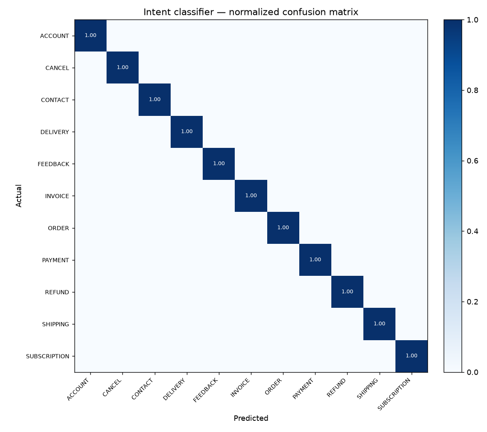

# Intent Classifier — Evaluation Report — 2026-07-18

- **Dataset:** `bitext/Bitext-customer-support-llm-chatbot-training-dataset` (Bitext customer-support, real)
- **Task:** classify a customer message into one of 11 support categories
- **Model:** TF-IDF (word 1-2gram + char 3-5gram) → LogisticRegression (balanced)
- **Split:** 21,497 train / 5,375 test (stratified, 80/20)

## Headline metrics

| Metric | Value |
|---|---|
| Accuracy | 1.000 |
| Macro-F1 | 1.000 |
| Weighted-F1 | 1.000 |

## Per-class

| Category | Label | Precision | Recall | F1 | Support |
|---|---|---|---|---|---|
| ACCOUNT | Account & Access | 0.999 | 1.000 | 1.000 | 1197 |
| ORDER | Order Management | 1.000 | 0.999 | 0.999 | 798 |
| REFUND | Refund | 1.000 | 1.000 | 1.000 | 598 |
| INVOICE | Invoice & Billing | 1.000 | 1.000 | 1.000 | 400 |
| CONTACT | Contact / Human Agent | 1.000 | 1.000 | 1.000 | 400 |
| PAYMENT | Payment | 1.000 | 1.000 | 1.000 | 400 |
| FEEDBACK | Feedback & Complaint | 1.000 | 1.000 | 1.000 | 399 |
| DELIVERY | Delivery | 1.000 | 1.000 | 1.000 | 399 |
| SHIPPING | Shipping | 1.000 | 1.000 | 1.000 | 394 |
| SUBSCRIPTION | Subscription | 1.000 | 1.000 | 1.000 | 200 |
| CANCEL | Cancellation | 1.000 | 1.000 | 1.000 | 190 |

Confusion matrix: 

## Interpretation

In-distribution accuracy saturates because the Bitext categories are **lexically well-separated** — each is dominated by distinctive signal words (*refund*, *cancel*, *invoice*, *password*, *delivery*…) that a TF-IDF model picks up trivially. This is genuine separability, not train/test leakage (normalized templates were checked: none span more than one category, ~1.1 rows per template).

The honest test of the model is therefore **out-of-distribution generalization** on messier, non-templated text. That is measured separately on the synthetic product-support transcripts (which carry seed intent labels) in `data/processed/conversations_*` — see `scripts/precompute_conversations.py`. The Groq LLM fallback in `src/intent_classifier.py` exists precisely to catch the low-confidence, out-of-distribution cases this in-distribution score does not stress.

